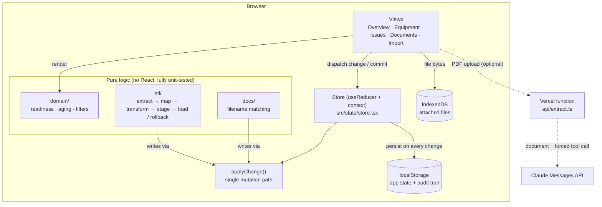
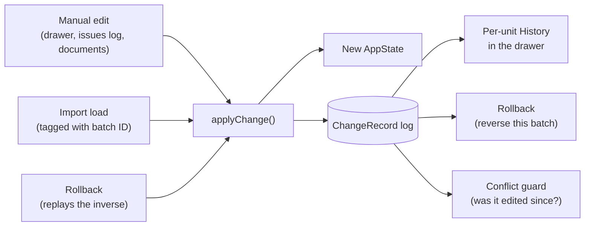
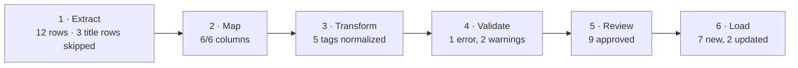
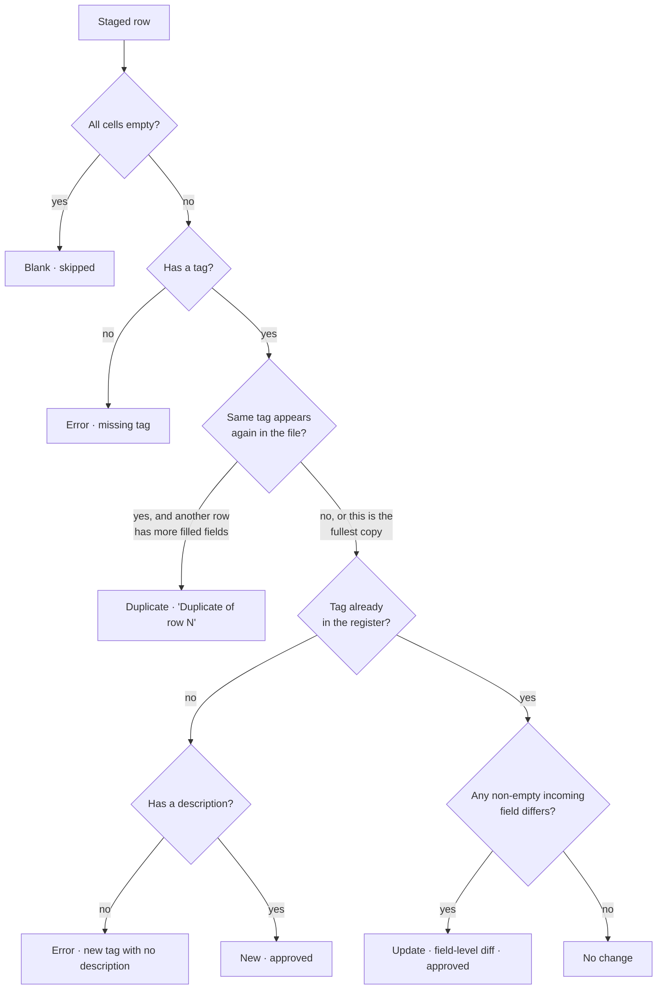
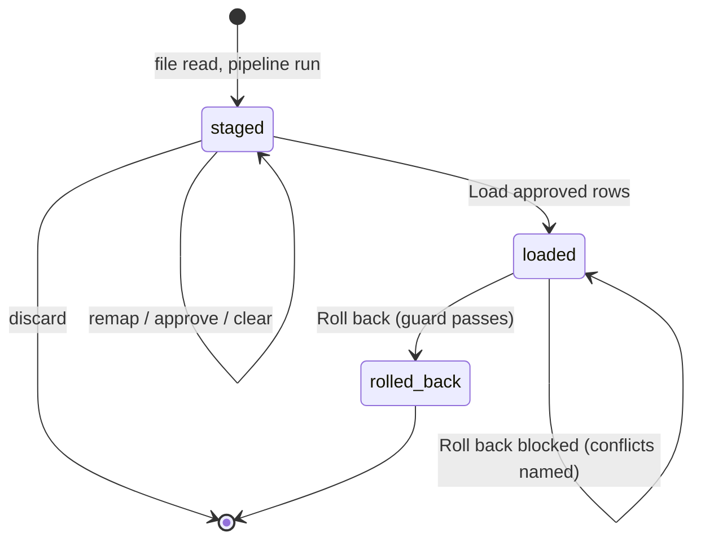
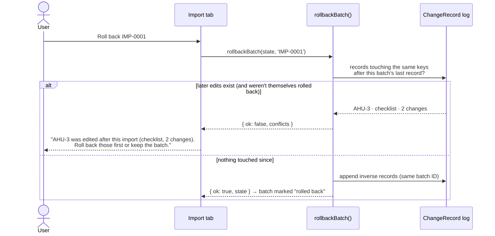
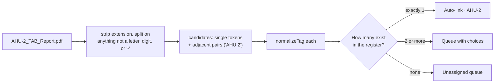
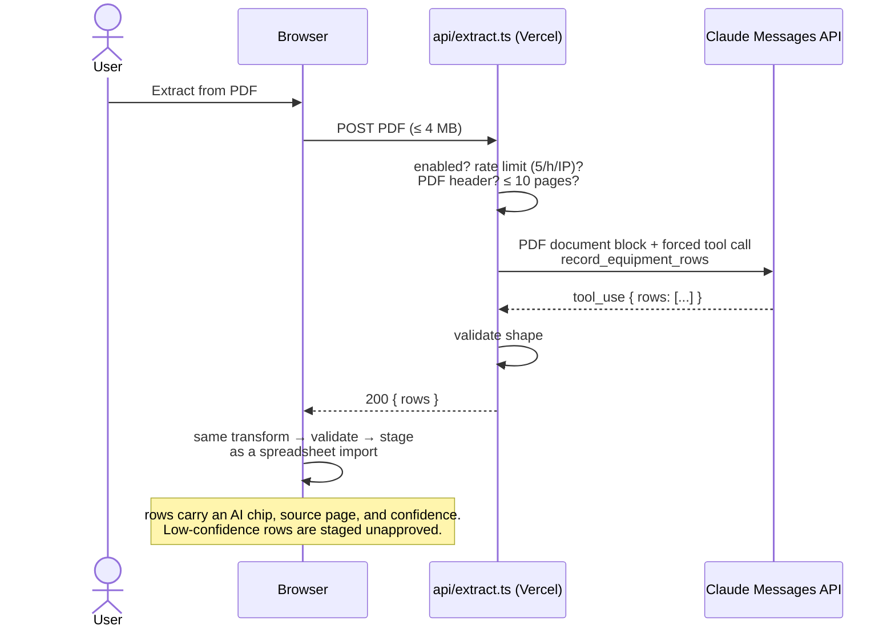
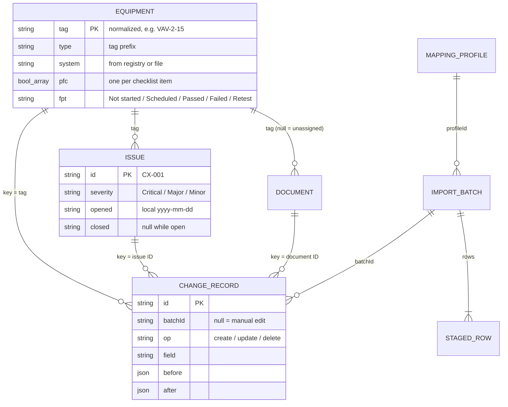

# Cx Ledger

**A commissioning tracker for HVAC and electrical systems, with an import pipeline that takes the spreadsheets contractors actually send.**

Commissioning ("Cx") checks that a building's equipment is installed and works the way the owner specified. Each air handler, pump, and transfer switch gets a pre-functional checklist (PFC), a functional performance test (FPT), and an issues log. The tracking itself is simple. What's hard is the data coming in: equipment schedules arrive as Excel workbooks with title blocks, merged headers, inconsistent tags (`ahu 3`, `AHU-3`, `VAV2-15`) and duplicate rows. Contractors resend the same file with small changes.

Cx Ledger is a working demo of both halves:

- **The tracker:** a readiness overview, an equipment register, per-unit checklists and test status, an issues log with aging, and a document library keyed to equipment tags.
- **The import pipeline:** CSV/Excel extraction, header detection, fuzzy column mapping, tag normalization, staged review with field-level diffs, idempotent loads, and **batch rollback backed by an audit trail**.

Everything runs in the browser against a fictional project, the Kettle Creek Water Treatment Plant, Administration & Laboratory Building. There's no backend and no real project data.

> Live demo: TBD (added after deploy) · Inspired by commissioning data work I supported at an engineering firm's commissioning group in 2016.

---

## Contents

- [Architecture at a glance](#architecture-at-a-glance)
- [The one rule: every change goes through `applyChange()`](#the-one-rule-every-change-goes-through-applychange)
- [The import pipeline](#the-import-pipeline)
- [A worked example](#a-worked-example)
- [Loads, rollback, and the conflict guard](#loads-rollback-and-the-conflict-guard)
- [Document intake](#document-intake)
- [AI extraction from PDFs (optional)](#ai-extraction-from-pdfs-optional)
- [Domain model](#domain-model)
- [Testing strategy](#testing-strategy)
- [Design decisions](#design-decisions)
- [Repository map](#repository-map)
- [Running it](#running-it)

---

## Architecture at a glance



There are three layers, and the dependencies point one way:

| Layer | Lives in | Knows about React? | What it does |
|---|---|---|---|
| **Views** | `src/views`, `src/components` | yes | Render state, collect decisions, never compute business rules |
| **Store** | `src/state` | yes (thin) | Holds `AppState`, persists it, routes every mutation through `applyChange()` |
| **Pure logic** | `src/domain`, `src/etl`, `src/docs`, `src/data`, `src/lib` | no | Everything that could be wrong: tag rules, readiness, parsing, diffing, rollback |

Because the pure layer has no React in it, the whole import pipeline can be tested (and ported to a server later) without a browser.

---

## The one rule: every change goes through `applyChange()`

Equipment, issues, and documents are only ever changed by `applyChange(state, change, meta)` in `src/state/applyChange.ts`. It returns a new state and appends one **`ChangeRecord` per changed field**:

```ts
{ id: 'CR-00042', batchId: 'IMP-0001' /* or null for a manual edit */,
  entity: 'equipment', key: 'AHU-1', op: 'update',
  field: 'serial', before: 'K22H4410', after: 'K22H4410-R',
  at: '2026-09-26T16:00:00.000Z', actor: 'Demo user' }
```

That one function makes three features possible:



- **History:** the equipment drawer lists every change to a unit, newest first, and links imported changes back to their batch.
- **Rollback:** a batch is undone by replaying its own records in reverse.
- **Conflict detection:** the log shows whether anything touched a record *after* a given import.

No-op updates write nothing. Updating a field to the value it already has returns the same state object. That's part of why loading the same file twice leaves no trace the second time.

---

## The import pipeline

The Import tab shows the pipeline as numbered steps, each with its own count, because the order is real:



Each stage is a pure function `(input, register) → output + notes`. The UI only renders the result and collects decisions, so changing any mapping dropdown re-runs the whole pipeline live.

### 1 · Extract: turn anything into a grid of strings

| Source | How |
|---|---|
| Pasted text | `parseCsv`: a hand-written RFC 4180 parser (quoted fields, `""` escapes, commas inside quotes, CRLF/LF). It strips a UTF-8 BOM and auto-detects **tab-separated** input, because cells copied from Excel paste as TSV. |
| `.csv` | Same parser. |
| `.xlsx` / `.xls` | `readWorkbook` via SheetJS, loaded **lazily** only when an Excel file is picked. It returns display text for every cell. **Merged ranges are filled before anything else looks at the grid**, so a header merged across two rows isn't read as a blank. |

### 2 · Map: find the header, then match columns to fields

**Header detection** scores each of the first 15 rows by how many cells look like a known field name, plus a small bonus for rows of mostly short text. It picks the best row with a score of at least 2, and everything above it is reported as skipped title rows. In the sample workbook, the title block ("KETTLE CREEK WTP — MECHANICAL EQUIPMENT SCHEDULE", "Rev 3", a merged cell) scores ≤ 1.5, and the real header scores 6.5.

**Fuzzy column matching** compares each header against each field's synonyms, after lowercasing and removing non-alphanumerics (`"Model #"` → `model`). The best of three scores wins:

| Rule | Score | Example |
|---|---|---|
| Exact synonym | 1.0 | `Loc.` → `loc` → **location** |
| One contains the other (≥ 3 chars) | 0.8 | `Equipment Desc.` → **desc** |
| Levenshtein similarity ≥ 0.75 | 0.75–0.99 | `Manufactuer` (typo) → **mfr**, 0.92 |

Fields are assigned greedily, highest score first, one header per field. Anything under 0.8 is flagged for a look.

**Saved mapping profiles** remember how one contractor's file maps. A profile is keyed by a *header signature*: the sorted, normalized header names. A file with the same headers in any order gets the profile applied automatically. A file sharing ≥ 80% of them gets it offered as a suggestion.

### 3 · Transform: normalize once, at the boundary

The equipment tag is the key everything else attaches to (issues, checklists, documents, change records), so it's normalized in exactly one place, and nothing downstream ever sees a raw tag:

```
normalizeTag:  trim → UPPERCASE → spaces/underscores become "-" → collapse "--"
               → insert "-" between the letter prefix and the first digit → strip stray "-"

  "ahu 3"    → AHU-3        "VAV2-15" → VAV-2-15      "gen1" → GEN-1
  "P 5"      → P-5          "XFMR-T1" → XFMR-T1       "_ahu3" → AHU-3
```

The prefix gives the equipment **type** (`VAV`, `AHU`, `ATS` …) and, through a small registry, its **system** (Air side, Hydronic, Electrical, Controls, Plumbing). Every change the transform makes is written onto the row as a note, e.g. `Tag normalized: "ahu 3" → "AHU-3"`, so the reviewer can see what the pipeline did.

### 4 · Validate: every row lands in exactly one bucket



Warnings (unknown tag prefix, blank description on an update) never block a row. Updates **merge only non-empty values** and never blank out data already in the register.

### 5 · Review, then 6 · Load

The review table shows row number, source tag → normalized tag, the result chip, the field-by-field diff, notes, and an approve checkbox. **Nothing touches the register until Load.** Staged batches are saved with the rest of the app state, so a half-reviewed import survives a page reload.

---

## A worked example

This is the sample contractor export shipped in `fixtures/contractor-export.csv`, loaded against the seeded register (it's also the golden test):

| Row | Source tag | Result | Why |
|---|---|---|---|
| 1 | `ahu 3` | **Duplicate** | Row 2 is the same tag with more fields filled in (it has a serial) |
| 2 | `AHU-3` | **New** | Not in the register. Double spaces in the description get cleaned |
| 3 | `ef-4` | **New** | Tag normalized; stray spaces around the description trimmed |
| 4 | `P 5` | **New** | → `P-5`, Hydronic |
| 5 | `VAV2-15` | **New** | → `VAV-2-15`, gets the 5-item VAV checklist |
| 6 | *(empty)* | **Blank** | Skipped |
| 7 | `XFMR-T1` | **New** | Electrical |
| 8 | `AHU-1` | **Update** | description, location, serial differ |
| 9 | `gen1` | **Update** | serial only; the blank description keeps the register's value (warning) |
| 10 | `ZZ-9` | **New** | Unknown prefix → system `Unassigned` (warning) |
| 11 | `CH-2` | **New** | Hydronic |
| 12 | *(no tag)* | **Error** | Missing tag |

The Excel version (`fixtures/contractor-schedule.xlsx`) holds the same rows, plus a three-row title block, a merged description header, and a "Notes" sheet placed *first*. It has to produce the **identical** result row for row. That's the proof that sheet selection, header detection, and merge-filling all work.

---

## Loads, rollback, and the conflict guard



**Loads re-check every row against the register as it is *now*.** A staged batch can sit for a while, and the register may change in between. Rows are applied through `applyChange()` with the batch ID attached, and the recorded `before` value is the current one, never a stale snapshot. Loading the same file twice gives **0 new, 0 updated, 9 no change**.

**Rollback** walks the batch's change records newest-first and applies the inverse of each: an update restores `before`, a create becomes a delete. Rolling back the sample import restores the seeded register exactly (the test checks it with deep equality).

The **conflict guard** is what makes rollback safe to offer:



Three details matter here:

- **Undo runs in reverse order.** If a later import changed AHU-1, the earlier batch is blocked until that later batch is rolled back, and then it's allowed.
- **Dependent records block too.** If someone logged an issue or attached a document to a unit this batch *created*, rollback is blocked rather than leaving that issue pointing at a unit that no longer exists.
- **Rollback is audited like everything else.** It writes its own change records.

---

## Document intake

Most commissioning documents (submittals, TAB reports, test forms, O&M manuals) don't need to become data. They just need to be findable from the right unit. Dropping files on the Documents tab shows a match preview **before anything is saved**:



| File name | Result |
|---|---|
| `AHU-2_TAB_Report.pdf` | AHU-2 · TAB report |
| `ahu 2 submittal rev1.pdf` | AHU-2 · Submittal |
| `ATS1_OM_Manual.pdf` | ATS-1 · O&M manual |
| `AHU-1 and AHU-2 filters.pdf` | Queue: AHU-1 or AHU-2 |
| `Mech_Schedules_M-601.pdf` | Unassigned · Drawing |

The document kind comes from keywords in the file name, matched only at word boundaries, so "Boiler **Room**" isn't read as an O&M manual and "**sub**station" isn't read as a submittal. File bytes go to IndexedDB (localStorage only holds strings and tops out around 5 MB). Opening a file uses a short-lived `blob:` URL, and uploads are capped at 25 MB per file.

---

## AI extraction from PDFs (optional)

Equipment schedules often arrive as PDF drawings. The design rule is **the model proposes rows; the pipeline decides.**



- **The model is never trusted directly.** Its rows go through the same normalization, validation, diffing, and human review as any file import. Nothing loads without approval.
- **Try the sample** replays a bundled, cached response, so portfolio visitors see the whole flow without any API call.
- **The key stays server-side.** `ANTHROPIC_API_KEY` and `ANTHROPIC_MODEL` are Vercel environment variables. The build is checked so the key never appears in client code. The endpoint is off unless `EXTRACT_ENABLED=true` (see `.env.example`).
- **Abuse limits:** 4 MB per upload (under Vercel's 4.5 MB request limit), 10 pages, and 5 requests per hour per IP. The rate limit is held in memory, so it applies per serverless instance, not globally. Page counting also reads compressed object streams, with a cap on how much it will decompress. A PDF whose pages can't be counted is rejected rather than sent to the model.
- **Model requirement:** the function forces a tool call (`tool_choice`), so `ANTHROPIC_MODEL` must support forced tool use, e.g. `claude-opus-5` or `claude-sonnet-5`. `claude-opus-5-5`, `claude-fable-5-1`, and `claude-mythos-5-1` reject it. With one of those set, the endpoint returns an error that names the model setting.

---

## Domain model



**Readiness** is derived, never stored:

| State | Rule |
|---|---|
| **Ready** | PFC complete, FPT passed, and no open issues |
| **Blocked** | FPT failed, or an open Critical issue |
| **Open** | Anything else |

**Checklists are keyed by equipment type, falling back to system.** A VAV box gets VAV installation checks (inlet duct, reheat valve, airflow sensor…), not the generic air-side list. Dates are built in **local time**, so a 10 pm edit in Chicago isn't recorded as tomorrow.

---

## Testing strategy

**175 tests across 39 files** (Vitest + Testing Library):

- **Golden tests** pin the whole pipeline to hand-derived expectations: the CSV and the `.xlsx` must produce identical staged rows, and loading twice must be idempotent. They also cover rollback to exact seed state, a blocked rollback with the exact conflict message, undoing imports in reverse order, a saved profile auto-applying to reordered headers, and the AI cached-response pipeline.
- **Unit tests** cover `normalizeTag`, `parseCsv`, `detectHeader`, fuzzy matching, `matchFilename`, derived states, aging buckets, and `applyChange`.
- **The Overview numbers are hand-counted** from the seed data (27 units, 18/27 PFCs complete, 11/27 FPTs passed, 12 open issues, median 23 days open), and a test asserts them.
- **Edge cases users actually hit** each have a test:
  - Excel paste arriving as TSV
  - CSVs saved with a hidden byte-order-mark (BOM) character
  - a staged import loaded after the register changed
  - a rollback blocked by a later import
  - corrupt saved state falling back to the seed instead of a white screen
  - double-clicking Save
- **An honesty test** checks that the UI and README keep the required demo and attribution wording.

---

## Design decisions

| Decision | Why |
|---|---|
| **Pure functions for every pipeline step** | Each step can be tested with plain data, it's easy to reason about, and it ports directly to a server-side staged job later (FastAPI + Postgres was the planned phase 2). |
| **One mutation path (`applyChange`)** | The audit trail, per-unit history, rollback, and the conflict guard all come from one invariant instead of four features. |
| **Normalize tags only at the boundary** | The tag is the join key for everything, so a second normalization site would mean two definitions of identity. |
| **Stage before load** | Contractor data is messy. Showing the diff before writing turns import into a review task instead of a cleanup task. |
| **Block rollback instead of cascading** | Silently deleting a later manual edit or a newly logged issue would destroy work. The guard names the conflict and lets a person decide. |
| **Hand-written CSV parser and fuzzy matcher** | Both are small and well-tested, and they keep the dependency list short and auditable. SheetJS is the one heavy dependency, and it's lazy-loaded. |
| **localStorage for state, IndexedDB for files** | Each viewer gets their own sandbox with no backend. Files need binary storage and more room than localStorage allows. |

CxAlloy and Facility Grid cover this space commercially. If this were a product, integrating with them would make more sense than competing. This demo is about the import pipeline.

---

## Repository map

```
api/extract.ts            Vercel function: PDF → Claude → validated rows (optional feature)
fixtures/                 Golden CSV, the matching .xlsx, AI sample PDF + cached response
scripts/build-fixtures.ts Regenerates the .xlsx and sample PDFs (npm run fixtures)
src/
  types.ts                Every shared type (Equipment, Issue, ChangeRecord, ImportBatch …)
  data/                   Tag registry + normalizeTag, checklists, seed project
  domain/                 Readiness, aging, overview stats, register/issue filters, history
  state/                  applyChange, persistence, store + UI context
  etl/                    parseCsv · readWorkbook · detectHeader · fuzzy · profiles ·
                          transform · stage · load · rollback · aiExtract
  docs/                   matchFilename, IndexedDB blob store, intake, open-in-tab
  views/                  Overview, Equipment (+ drawer), Issues, Documents, Import (+ panels)
  components/             Chip, Nameplate, Banner, About, DropZone, Tabs
  styles/                 Design tokens (light/dark) and app CSS
```

---

## Running it

```bash
npm i
npm run dev        # start the dev server
npm test           # run the test suite
npm run build      # typecheck + production build
npm run fixtures   # regenerate the Excel and PDF test fixtures
```

Then open the **Import** tab and load `fixtures/contractor-schedule.xlsx`, or click **Try the sample** to see AI extraction without an API key. **Reset demo data** in the banner restores the seed project at any time.

Stack: React 18 · TypeScript (strict) · Vite · Vitest · Testing Library · SheetJS · idb-keyval · plain CSS with design tokens (light and dark).

## Screenshots

Coming soon.
